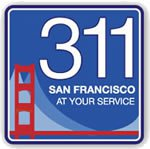

  

## 311 Case Data: Data Analysis

[SF OpenData](https://data.sfgov.org/) provides a real-time record and API for [311 cases completed and in progress](https://data.sfgov.org/City-Infrastructure/Case-Data-from-San-Francisco-311-SF311-/vw6y-z8j6). The Data Science Working Group at Code for San Francisco looks to perform exploratory statistical analyses on this data to see whether it might posses strategically and/or politically interesting characteristics, which we will later confirm -via inferential statistics- and report to relevant stakeholders (e.g. San Francisco's public agencies and/or the publics they serve).  

**Responsible DSWG Teammates**
+ [Matthew Pancia, Ph.D.](http://bit.ly/1PFuA8k)
+ [Elena Palesis](http://bit.ly/1mgjXl4)
+ [Jude Calvillo (Project Lead)](http://linkd.in/1BGeytb)
+ [Jeff Lam](http://bit.ly/1Pm9SLJ)
+ [Matthew Mollison, Ph.D.](http://bit.ly/1PPZXSa)
+ [Hannah Burak](http://bit.ly/1U7D13N)

### Current Status: March 23, 2016

After some great discussions with the City's Chief Data Officer, Joy Bonaguro, we've updated our Census profiling to the tract level and matched our neighborhoods to those more commonly used in SF OpenData, so as to help with accuracy and agency compatibility.  

We've also *moved our exploratory analyses to a sub-directory*, as we're now working through our more substantive statistical tests and reporting.

+ [**Click to view our exploratory analyses (visuals, summaries, etc) >>**](/Exploratory_Analyses/)

*What you see below is a foundation for integrating our statistical tests and final reporting.*

### Introduction

+ Intro w/impetus.
+ Acknowledgements.
*Please note: This introduction will soon replace the one above.*

### Literature Review

+ What's been done for 311 in other cities?
+ What complications have they encountered?
+ What's possible?

### Methodology

+ Overall approach and boundaries, along with approach to special circumstances.
+ Census data concerns and integration.
+ Data sources.

### Research Questions

#### Operational Concerns

1. What case features predict cases that would later become 'invalid'?
2. Can we predict one kind of request type from requests for another type(s)?
3. Can we fairly accurately forecast the frequency of one or more request categories from their apparent seasonality?
4. Similarly, can we detect anomalies in frequency of one or more request categories, particularly per census tract?
5. Has reporting 'homeless concerns' substantially changed since 311 changed its app and voice menus around such reporting?
6. Is there any potential for more responsive reporting tools via app or voice interfaces? (i.e. they change upon meeting one or more conditions)  

#### Equity Concerns

1. Which features of calls (location, request type, source, caselength, etc) are good predictors of income?
2. How are 311 requests distributed across Census block income levels?
3. How are 311 request resolution times distributed across Census block income levels?
4. Is there a correlation between resolution time and percent (%) any racial or ethnic population?

### Conclusion / Implications

#### Public Policy

#### Operations

#### Product Opportunities

#### Future Research

### Appendix
